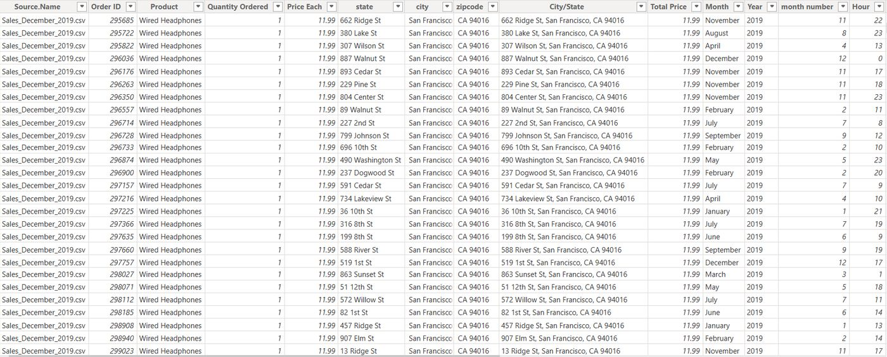
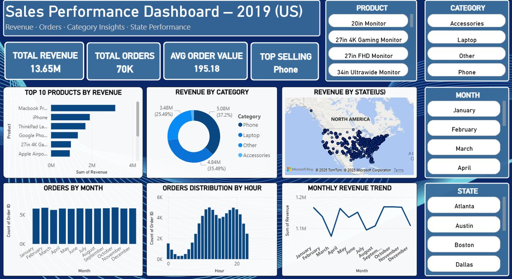

# Sales Performance Analysis — Power BI (US, 2019) 📊


A premium portfolio project analyzing US sales (2019) using **Microsoft Power BI**. The report includes KPIs, product/category performance, state-level map, time-of-day patterns, and monthly revenue trend.

## 🚀 Key KPIs
- **Total Revenue:** ~13.65M  
- **Total Orders:** ~70K  
- **Avg Order Value:** ~195.18  
- **Top-Selling Category:** Phone

> Values above are read from the dashboard KPI tiles. Exact values may vary with slicers.

## 🖼️ Dashboard Preview
**Full Dashboard:**  


**Data View (transformed table snapshot):**  


## 🔍 Insights (Highlights)
- Premium SKUs (e.g., MacBook, iPhone) drive the top-line.
- Phones and Laptops dominate revenue share; Accessories steady.
- Orders are steady across months; evening hours show peaks.
- Geographic hotspots cluster around major metro states.

## 🧰 Skills & Techniques
- Power Query cleaning and feature engineering (Month, Year, Hour).
- DAX measures for KPIs (Revenue, Orders, AOV).
- Interactive slicers: **Product, Category, Month, State**.
- Visual design & layout for readability.

## 📁 Repository Structure
```
Sales-Performance-Analysis-PowerBI
├── Sales Performance Dashboard.pbix           # ← add your PBIX here
├── README.md
├── LICENSE
├── .gitignore
├── assets/
│   ├── dashboard.jpg
│   └── data_view.jpg
└── data/
    ├── README_DATA.md
    └── (place CSVs here, optional)
```

> Place your local `Sales Performance Dashboard.pbix` and any CSVs (optional) before committing.

## 🧪 How to Use
1. Download this repo and **add your PBIX** at the root.
2. Open in **Power BI Desktop** and explore with slicers.

## 📝 Case Study (Short)
**Questions:** Which products/categories drive revenue? Where are geographic hotspots? How do monthly and hourly patterns vary?  
**Findings:** Premium products lead, phones dominate category share, evening demand peaks, and large metro states concentrate revenue.

## 🌱 Future Enhancements
- Add profit/COGS for margin views
- RFM/customer segmentation
- Drill-throughs and bookmarks
- Publish to Power BI Service

## 👤 Author
**Vinay Akana** — LinkedIn: https://www.linkedin.com/in/vinay-akana-1264632b6/ — Email: vinayakana321@gmail.com

⭐ If this project helped, please star the repo!
